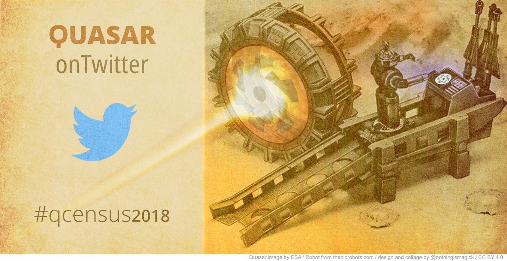

#### qcensus2018 - documentary repo

[Utopian.io style breakdown and proof of authorship](https://steemit.com/utopian-io/@nothingismagick/qcensus2018-campaign-graphics-breakdown)

Quasar image by ESA / Robot from theoldrobots.com / design and collage by @nothingismagick / CC BY 4.0

Statement of compliance:
This project has been officially sanctioned by The Quasar Framework, and I have signed the  FLA, which can be found here: https://goo.gl/forms/MhyO37oz7AsUtfdw2 - so to that extent I am permitted to publish derivative work using the Quasar Logo.
